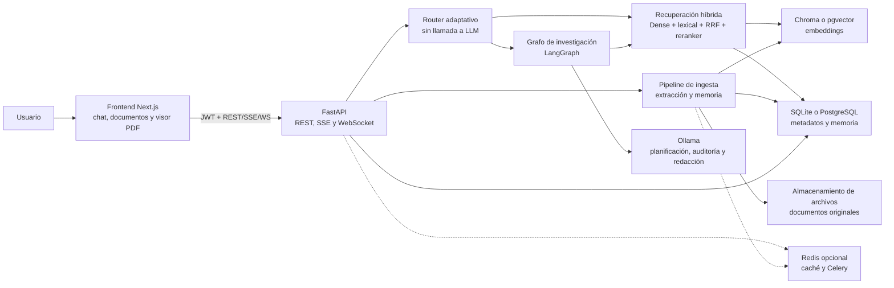
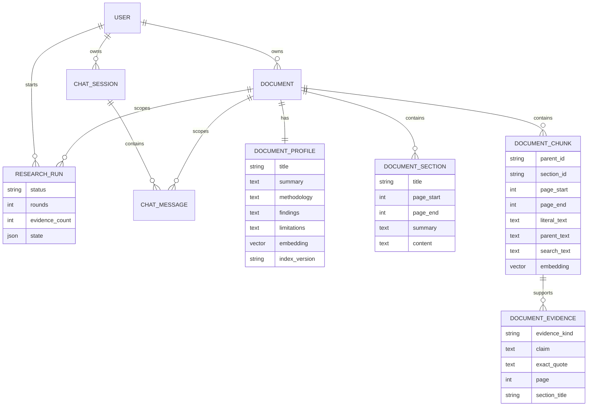
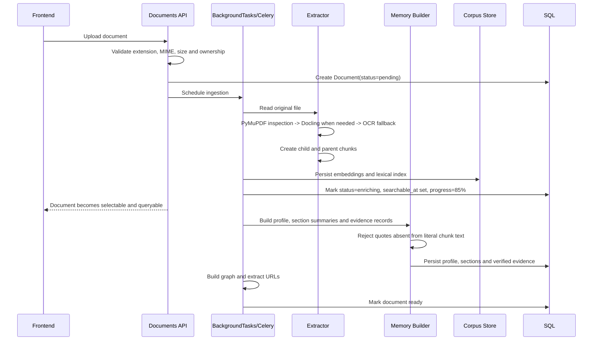
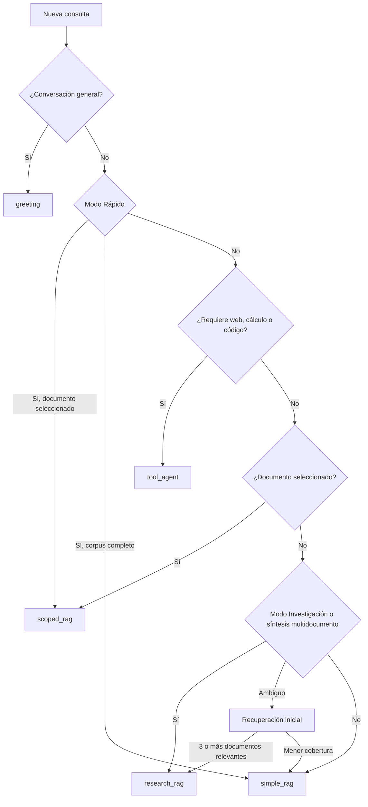
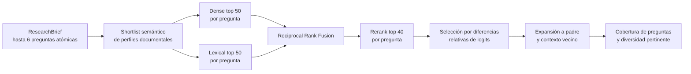
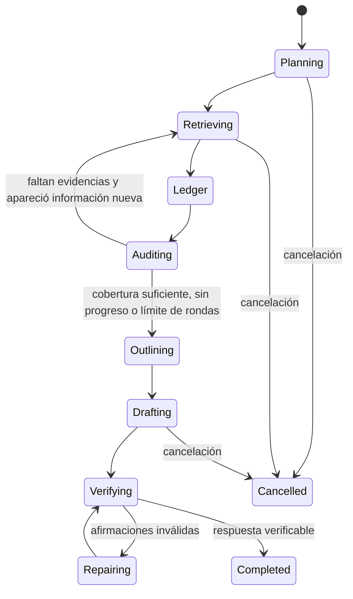
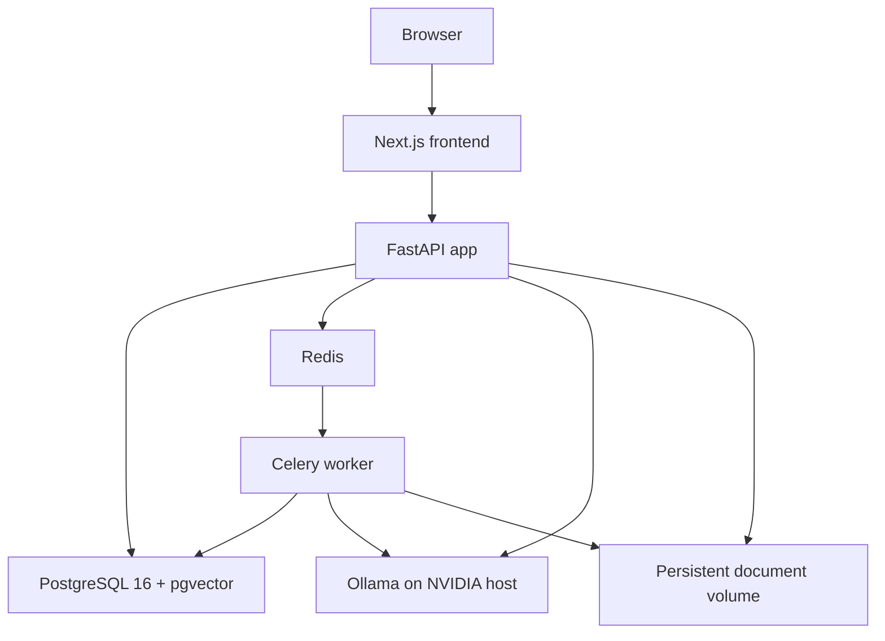
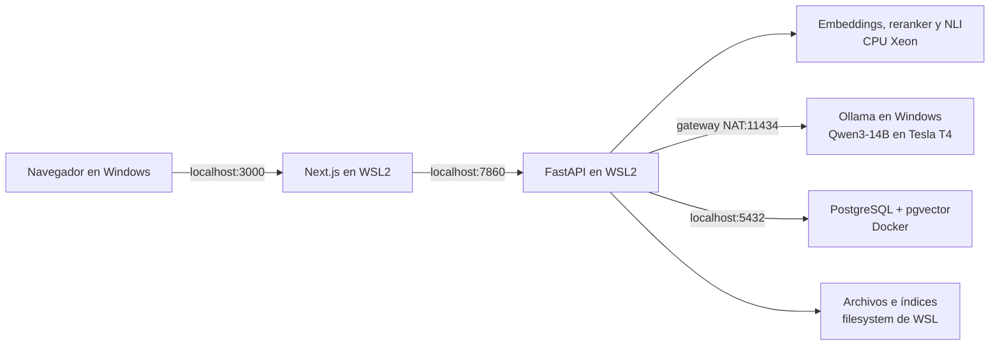

# Arquitectura de ATLAS

Este documento describe la arquitectura vigente de ATLAS, un sistema RAG orientado a investigación académica. Su alcance incluye la interfaz web, la API, la ingesta documental, la memoria estructurada del corpus, la recuperación híbrida, el agente de investigación, la verificación de respuestas y los perfiles de despliegue.

La fuente de verdad para valores configurables es `backend/app/config.py`. Las versiones de modelos e índices forman parte de las claves de caché y de los metadatos del corpus.

La versión pública actual de la API es `2.0.0`. Los cambios por versión y los hitos anteriores se registran en [`CHANGELOG.md`](../CHANGELOG.md).

## Objetivos arquitectónicos

- Responder exclusivamente desde evidencia recuperada de los documentos seleccionados o cargados.
- Mantener trazabilidad desde una afirmación hasta el archivo, página, sección, tabla o figura correspondiente.
- Separar las necesidades de evidencia de los requisitos de redacción y formato.
- Recuperar información en español, inglés y otros idiomas sin vocabularios de dominio codificados.
- Permitir investigación iterativa sin exponer cadena de pensamiento.
- Conservar una ruta rápida para consultas directas y una ruta profunda para síntesis multifuente.
- Operar con perfiles reproducibles para desarrollo ligero, Mac con MPS, servidores NVIDIA y Windows/WSL2 con Ollama separado del backend.

## Vista general



## Componentes

| Componente | Responsabilidad | Implementación principal |
| --- | --- | --- |
| Frontend | Selección documental, modos de consulta, streaming, citas y cancelación | Next.js, React, TypeScript |
| API | Autenticación, documentos, chats, sesiones, streaming y persistencia | FastAPI, Pydantic, SQLAlchemy |
| Router | Selección entre conversación, RAG directo, investigación y herramientas | Reglas ponderadas independientes del dominio |
| Ingesta | Extracción, fragmentación, embeddings, perfiles, resúmenes y evidencias | Docling, PyMuPDF, OCR, Sentence Transformers |
| Recuperador | Búsqueda densa y léxica, RRF, reranking y expansión de contexto | Chroma/pgvector, FTS5/tsvector, Qwen3 o modelos locales |
| Agente de investigación | Planificación, búsquedas correctivas, ledger, auditoría, redacción y reparación | LangGraph y Ollama |
| Verificador | Validación de citas, números e inferencias | Comprobaciones deterministas y auditoría estructurada con LLM |
| Persistencia | Usuarios, documentos, memoria, ejecuciones y conversaciones | SQLite local o PostgreSQL 16 en producción |
| Procesamiento asíncrono | Ingesta fuera del ciclo HTTP | FastAPI BackgroundTasks o Celery + Redis |

## Perfiles de ejecución

### Desarrollo local ligero

El perfil `local` mantiene un consumo moderado de memoria:

| Función | Tecnología |
| --- | --- |
| Metadatos y conversaciones | SQLite |
| Recuperación léxica | SQLite FTS5 |
| Recuperación vectorial | ChromaDB |
| Embeddings | `intfloat/multilingual-e5-small`, 384 dimensiones, CPU |
| Reranker | `cross-encoder/mmarco-mMiniLMv2-L12-H384-v1`, CPU |
| LLM | Modelo configurado en Ollama |

### Mac con MPS

El perfil `local_balanced` conserva el índice Qwen usado por los despliegues de investigación, pero limita lotes y memoria para una Mac M1 de 8 GB:

| Función | Tecnología |
| --- | --- |
| Metadatos y conversaciones | SQLite |
| Recuperación léxica | SQLite FTS5 |
| Recuperación vectorial | ChromaDB |
| Embeddings | `Qwen/Qwen3-Embedding-0.6B`, 1024 dimensiones, MPS, lote 4 |
| Reranker | `Qwen/Qwen3-Reranker-0.6B`, CPU |
| LLM | `qwen3:4b-instruct-2507-q4_K_M` mediante Ollama |
| Extracción PDF recomendada | `fast`, con PyMuPDF y OCR selectivo |

### Producción NVIDIA

El perfil `research_gpu` selecciona automáticamente:

| Función | Tecnología |
| --- | --- |
| Metadatos y corpus | PostgreSQL 16 |
| Recuperación léxica | `tsvector`, GIN, `unaccent`, `pg_trgm` |
| Recuperación vectorial | pgvector con índice HNSW |
| Embeddings | `Qwen/Qwen3-Embedding-0.6B`, 1024 dimensiones |
| Reranker | `Qwen/Qwen3-Reranker-0.6B` |
| Planificador y redactor | `qwen3:30b-a3b` mediante Ollama |

El embedding se mantiene en CPU y el reranker en CUDA. Antes de invocar el redactor se liberan los modelos de recuperación para reducir la presión sobre la VRAM.

### Windows, WSL2 y Tesla T4

El perfil `wsl_t4` separa la inferencia generativa del resto del pipeline:

| Componente | Ubicación y configuración |
| --- | --- |
| Frontend y backend | Ubuntu en WSL2, ejecución nativa |
| PostgreSQL 16 + pgvector | Único servicio obligatorio en Docker |
| Ollama | Windows, accesible desde WSL mediante el gateway NAT |
| LLM | `qwen3:14b-q4_K_M`, contexto 8192, Tesla T4 dedicada |
| Embeddings | Qwen3-Embedding-0.6B, CPU, lote 64 |
| Reranker y NLI | CPU Intel |
| Paralelismo PyTorch | 28 hilos por defecto, configurable |

`backend/app/rag/llm_client.py` centraliza `base_url`, timeout y `keep_alive` para todas las etapas que usan Ollama. `make doctor-wsl` valida el perfil, el modelo remoto, PostgreSQL y sus extensiones; `make dev-wsl` resuelve la dirección de Windows y ejecuta el diagnóstico antes de iniciar ATLAS.

## Modelo de datos



`DocumentChunk.text` conserva el fragmento literal usado en citas. `search_text` añade contexto neutral, como archivo, sección y etiqueta de tabla, exclusivamente para recuperación. Esta separación impide que los encabezados añadidos al índice se presenten como una cita textual.

## Ingesta y memoria documental



### Extracción

1. `PDF_EXTRACTION_MODE=fast` usa PyMuPDF y aplica OCR únicamente a páginas con texto insuficiente.
2. `PDF_EXTRACTION_MODE=quality` usa Docling para preservar layout, tablas, páginas y coordenadas.
3. En modo `auto`, PyMuPDF inspecciona primero el documento; Docling solo se activa ante páginas vacías o tablas detectadas.
4. Si Docling falla, el pipeline intenta `unstructured` cuando está habilitado, `pdfplumber`, PyMuPDF y finalmente OCR completo.
5. DOCX, texto, Markdown y archivos de código usan extractores específicos.

### Fragmentación jerárquica

- Los fragmentos hijos contienen aproximadamente 420 tokens, con 80 tokens de solapamiento.
- Los contextos padre agrupan aproximadamente 1600 tokens.
- Cada hijo conserva sección, rango de páginas, coordenadas y referencia al padre.
- Las tablas se almacenan como unidades independientes con su índice y bounding box.
- El hijo se usa para recuperar; el padre se usa para dar contexto al redactor.

### Memoria estructurada

Por cada documento se generan:

- perfil temático;
- metodología visible;
- hallazgos visibles;
- limitaciones visibles;
- resumen global y resúmenes por sección;
- evidencias tipadas como método, resultado, limitación, definición o contexto.

Una evidencia generada solo se guarda si `exact_quote` existe literalmente en el chunk indicado. La memoria mejora la selección del documento, pero nunca sustituye al fragmento como fuente verificable.

### Disponibilidad y progreso

La ingesta tiene una fase bloqueante y una fase de enriquecimiento. Tras persistir los índices vectorial y léxico, el documento pasa a `status=enriching`, recibe `searchable_at` y puede consultarse desde el 85%, aunque el resumen, la memoria y el grafo sigan procesándose. Un fallo posterior conserva el documento como `ready` con `processing_warning`.

| Etapa | Progreso |
| --- | --- |
| `queued` | 0% |
| `extracting` / layout / OCR | 5–25% |
| `chunking` | 25–40% |
| `embedding` | 40–80% |
| `persisting` | 80–85% |
| `searchable` | 85% |
| `summarizing` | 85–92% |
| `building_memory` | 92–96% |
| `building_graph` | 96–99% |
| `completed` o `completed_with_warnings` | 100% |

El backend mantiene progreso monotónico, unidades procesadas y un heartbeat. El frontend consulta estos campos periódicamente y diferencia el progreso de subida del progreso de procesamiento.

## Enrutamiento adaptativo

El router es compartido por REST, SSE y WebSocket. No llama a un LLM y no contiene relaciones temáticas de motores, medicina, sostenibilidad ni otros dominios.



### Rutas

| Ruta | Uso | Planificador | ReAct |
| --- | --- | --- | --- |
| `greeting` | Saludos y conversación general | No | No |
| `scoped_rag` | Consulta limitada al documento seleccionado | Solo en modo Investigación | No |
| `simple_rag` | Resumen, extracción, explicación o redacción directa | No | No |
| `research_rag` | Comparación, integración o síntesis multifuente | Sí | No |
| `tool_agent` | Web actual, cálculo, código o herramientas externas | Según necesidad | Sí |

Los requisitos estilísticos, como “actúa como investigador”, abstract, keywords, secciones o citas, no activan por sí solos la ruta de investigación.

## Recuperación híbrida

La recuperación profunda opera primero sobre perfiles documentales y luego sobre evidencia.



### Fusión

Dense y lexical producen escalas incompatibles. Por ello se fusionan por posición mediante Reciprocal Rank Fusion:

```text
RRF(d) = sum(w_i / (k + rank_i(d)))
```

El sistema no compara directamente distancia vectorial, puntuación FTS o logit del reranker.

### Reranking y selección

- Se rerankean como máximo 40 candidatos por pregunta atómica.
- Los logits se conservan como valores relativos de una misma consulta.
- No se aplica sigmoid ni un umbral global de probabilidad.
- Se conserva el grupo líder usando diferencias relativas entre resultados.
- La selección final cubre preguntas de evidencia y documentos pertinentes, con un máximo de tres chunks por documento.
- No existe una cuota mínima artificial de documentos; la diversidad no puede justificar una fuente tangencial.

## Agente de investigación

`research_rag` ejecuta un `StateGraph` con estado explícito y cancelable. Al finalizar o detenerse, el estado resumido de la ejecución se conserva en `ResearchRun`; el grafo no expone cadena de pensamiento.



### Estado de investigación

El estado contiene, entre otros campos:

- `ResearchBrief`: pregunta principal, preguntas atómicas, entregables y restricciones;
- evidencia recuperada y fuentes normalizadas;
- facetas respaldadas, faltantes y contradicciones;
- claim ledger con correspondencias pregunta-evidencia;
- esquema argumentativo con identificadores de fuente;
- número de ronda, reparaciones y evidencia nueva;
- respuesta actual, problemas detectados y deadline.

### Ciclo

1. Interpretar la solicitud y separar evidencia de formato.
2. Formular hasta seis preguntas de evidencia atómicas.
3. Recuperar evidencia independiente para cada pregunta.
4. Construir el claim ledger.
5. Auditar pertinencia, cobertura, vacíos y contradicciones.
6. Ejecutar hasta dos rondas correctivas si existe evidencia nueva.
7. Construir el esquema afirmación-evidencia.
8. Redactar una síntesis multifuente.
9. Verificar citas, números e inferencias.
10. Reparar una vez las afirmaciones problemáticas.

Por defecto, el grafo tiene un presupuesto de 1800 segundos, cada llamada al LLM puede usar hasta 900 segundos y se reservan 600 segundos para síntesis y verificación. Estos valores son configurables hasta los máximos validados en `Settings`. Si el límite vence después de recuperar evidencia, el sistema redacta la mejor respuesta verificable a partir del estado acumulado; no reemplaza el informe por una lista de chunks o facetas.

## Fidelidad y citas

Una respuesta de investigación debe contener argumento, comparación, conclusión y citas inmediatas. La ruta vigente combina comprobaciones deterministas con auditorías estructuradas mediante el LLM. El módulo NLI multilingüe permanece disponible para validaciones que lo activen, pero no es un requisito para `simple_rag`. La validación aplica las siguientes reglas:

1. Cada identificador `[D#]` debe corresponder a una fuente recuperada.
2. Las afirmaciones sustantivas deben tener una cita cercana.
3. Números, unidades, porcentajes y rangos deben aparecer en la evidencia citada.
4. Una inferencia multifuente solo es válida si cita sus premisas y se identifica como inferencia.
5. Una afirmación no respaldada se reescribe, limita o elimina.
6. Un parámetro sin evidencia se declara “no determinado por la evidencia disponible” sin invalidar el resto del informe.

La API devuelve para cada fuente:

- `source_id`;
- nombre del archivo;
- página inicial y final;
- sección;
- tipo de chunk;
- tabla o figura cuando aplica;
- bounding boxes para resaltado en el visor PDF.

## Streaming, progreso y cancelación

El frontend intenta WebSocket primero y usa SSE como fallback. Ambos transportes consumen el mismo generador y reciben los mismos eventos.

| Evento | Contenido |
| --- | --- |
| `progress` | etapa, ronda, cobertura, documentos y evidencias |
| `sources` | metadatos de citas verificables |
| `token` | texto de respuesta |
| `done` | finalización normal |
| `error` | fallo recuperable o terminal |

El usuario puede cancelar desde el botón del compositor. La cancelación cierra el WebSocket o aborta el SSE, activa el evento compartido del backend y evita guardar una respuesta vacía. No se transmite cadena de pensamiento; solo estados verificables como planificación, recuperación, auditoría y redacción.

## Persistencia y caché

Los mensajes de usuario y asistente se guardan en `ChatMessage` y pertenecen a una `ChatSession`. Las fuentes se serializan junto a la respuesta, lo que permite reconstruir la conversación tras cerrar y abrir la aplicación.

La caché usa Redis cuando `REDIS_URL` está configurado y un LRU en memoria como fallback. La clave incluye:

- usuario y alcance documental;
- pregunta y `top_k`;
- modo `auto`, `quick` o `research`;
- versión del router y pipeline;
- modelo y versión de embeddings;
- reranker, planificador y verificador.

Esto impide reutilizar una respuesta rápida como si fuera una respuesta de investigación o mezclar resultados de índices incompatibles.

## Migraciones y reindexación

Alembic administra las tablas de memoria documental y ejecuciones de investigación. PostgreSQL habilita `vector`, `unaccent` y `pg_trgm`, además de índices HNSW y GIN. SQLite crea su índice FTS5 equivalente.

Al iniciar, ATLAS compara la versión y dimensión efectivas del embedding con el índice persistido:

1. Los documentos incompatibles pasan a `processing/embedding`.
2. Se reconstruyen chunks desde el índice léxico existente cuando es posible.
3. Solo se vuelve a extraer el archivo original si no hay chunks reutilizables.
4. Se regeneran vectores, perfiles, secciones y evidencias derivadas.
5. Archivos, usuarios, conversaciones y resúmenes existentes se conservan.

La migración es idempotente y puede continuar después de una interrupción.

## Seguridad y aislamiento

- Todas las operaciones de documentos, chunks, perfiles, chats y ejecuciones se filtran por `user_id`.
- Un `document_id` seleccionado nunca se ignora ni amplía silenciosamente al resto del corpus.
- Los extractos recuperados se tratan como datos no confiables, no como instrucciones para el LLM.
- Las rutas administrativas requieren una dependencia de administrador.
- Los archivos originales permanecen fuera de las respuestas y se sirven únicamente tras validar propiedad.
- La cancelación o un error de generación no crea mensajes de asistente vacíos.

## Observabilidad

El backend registra:

- ruta, motivo, puntuación, modo, alcance y versión del router;
- modelos efectivos, dimensión y versión del índice al arrancar;
- preguntas atómicas, cobertura y documentos seleccionados;
- rondas, evidencia nueva, vacíos y contradicciones;
- estadísticas de verificación de afirmaciones;
- estado de migración e ingesta;
- latencia por consulta.

Los logs no deben contener cadena de pensamiento ni el contenido completo de documentos privados.

## Despliegue



El `Dockerfile` ejecuta `init_db`, aplica `alembic upgrade head` y luego inicia Uvicorn. `docker-compose.yml` ofrece perfiles `cpu` y `gpu`; ambos usan PostgreSQL en producción, mientras que `gpu` activa `MODEL_PROFILE=research_gpu`. Este perfil reserva la GPU NVIDIA para Ollama y el reranker, y ejecuta los embeddings en el CPU Intel con lotes de 64 para aprovechar la RAM del servidor. `CPU_THREADS=0` deja que PyTorch determine el paralelismo; puede fijarse explícitamente después de medir el servidor. Si CUDA no está disponible, el reranker cae a CPU sin impedir el arranque.

Para el despliegue Windows/T4 recomendado, no se usan los contenedores de aplicación ni GPU: `docker compose up -d postgres` inicia únicamente PostgreSQL, mientras frontend y backend corren en WSL y Ollama corre en Windows. La T4 queda reservada para un solo modelo generativo; embeddings, reranking y NLI se ejecutan en CPU. La guía operativa completa está en la sección “Tesla T4 y Qwen3-14B” del `README.md`.

### Topología Windows/WSL2/T4



Ollama escucha en Windows mediante `OLLAMA_HOST=0.0.0.0:11434`; `make dev-wsl` descubre el gateway NAT en cada arranque y lo entrega al cliente compartido como `OLLAMA_BASE_URL`. No se requiere modo de red mirrored ni un driver NVIDIA Linux en WSL para esta topología.

## Pruebas y benchmark

La verificación automatizada cubre:

- clasificación de rutas y paridad REST/SSE/WebSocket;
- recuperación multilingüe y dominios no vistos;
- RRF, shortlist documental, reranking y diversidad;
- tablas, secciones, páginas y citas;
- rondas correctivas, falta de progreso y timeout;
- claim ledger, filtrado de evidencia tangencial y síntesis al detenerse;
- cancelación y persistencia;
- migración e idempotencia;
- afirmaciones numéricas inventadas y citas inválidas.

`backend/app/rag/benchmark.py` calcula `Recall@20`, `nDCG@10`, precisión de citas, respaldo de afirmaciones, completitud y latencia. Los casos de prueba incluyen motores, medicina, geología, historia, economía y derecho, sin introducir vocabularios de esos dominios en la lógica de producción.

## Mapa del código

| Área | Archivo principal |
| --- | --- |
| Configuración | `backend/app/config.py` |
| Modelos SQL | `backend/app/models.py` |
| Migraciones | `backend/alembic/` |
| Ingesta | `backend/app/services/document_ingestion.py` |
| Extracción y chunks | `backend/app/rag/chunker.py` |
| Memoria documental | `backend/app/rag/summarizer.py` |
| Embeddings | `backend/app/rag/embeddings.py` |
| Índices | `backend/app/rag/vectorstore.py` |
| Recuperación y RRF | `backend/app/rag/retriever.py` |
| Reranker | `backend/app/rag/reranker.py` |
| Router y síntesis | `backend/app/rag/agent.py` |
| Grafo de investigación | `backend/app/rag/research_agent.py` |
| Cliente Ollama compartido | `backend/app/rag/llm_client.py` |
| Diagnóstico WSL/T4 | `backend/app/runtime_doctor.py` |
| API de chat | `backend/app/routes/chat.py` |
| UI de chat | `frontend/src/components/chat/ChatPanel.tsx` |
| Benchmark | `backend/app/rag/benchmark.py` |
| Historial de versiones | `CHANGELOG.md` |

## Invariantes de mantenimiento

1. La selección explícita de un documento siempre limita la recuperación a ese documento.
2. `simple_rag` y modo Rápido no invocan planificador ni grafo de investigación.
3. `research_rag` siempre entra al grafo y no usa ReAct.
4. ReAct se reserva para herramientas que puedan modificar el resultado.
5. Las facetas, prompts y estados internos nunca aparecen como evidencia en la respuesta.
6. El texto citado debe ser literal; el contexto añadido para búsqueda permanece separado.
7. Ningún dominio nuevo debe requerir cambios en Python para ser recuperado.
8. Una respuesta parcial respaldada es preferible a una respuesta completa con supuestos externos.
9. Un documento con índices persistidos sigue siendo consultable aunque falle su enriquecimiento posterior.
10. Todas las fases del LLM deben construir el cliente mediante `create_chat_ollama` para compartir host, timeout y permanencia del modelo.
